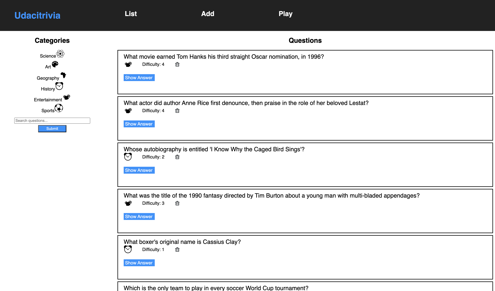

## Trivia API

This project is the backend API for the Udacitrivia web application. The API provides a system to manage a database of trivia questions, allowing users to view questions by category, add new questions, search for existing questions and play a quiz game.



## Features Implemented

This project involved building the entire backend RESTful API from a partially completed Flask application. The following features were implemented and fully tested using a Test-Driven Development (TDD) approach:

* **Endpoint for All Questions and Categories:** Implemented endpoints to fetch all available question categories and a paginated list of all questions.
* **Question Management:** Developed full Create and Delete functionality for questions in the database, allowing users to add new trivia and remove existing entries.
* **Category-Specific Views:** Created an endpoint to retrieve all questions belonging to a single, user-selected category.
* **Powerful Search:** Built a search endpoint that allows users to find questions based on a case-insensitive, partial text match.
* **Interactive Quiz Logic:** Designed and implemented the core quiz functionality with a stateful endpoint that serves random, non-repeating questions from either "All" categories or a specific one.
* **Robust Error Handling:** Implemented comprehensive error handlers for common status codes (`404`, `422`, `405`) to provide clear, consistent JSON error responses.

## Getting Started

### Prerequisites

* Python 3.9+
* Pip
* Node.js & NPM
* PostgreSQL

### Backend Installation & Setup

1.  **Clone the Repository:**
    ```bash
    git clone <your-repo-link>
    cd Udacitrivia
    ```

2.  **Navigate to the Backend Directory:**
    ```bash
    cd backend
    ```

3.  **Create and Activate a Virtual Environment:**
    ```bash
    python3 -m venv venv
    source venv/bin/activate
    ```

4.  **Install Dependencies:**
    ```bash
    pip install -r requirements.txt
    ```

5.  **Set up the Database:**
    Create the main database and load the starter data.
    ```bash
    dropdb trivia
    createdb trivia
    psql trivia < trivia.psql
    ```

### Frontend Installation

1.  **Navigate to the Frontend Directory:**
    ```bash
    cd frontend
    ```

2.  **Install Dependencies:**
    ```bash
    npm install
    ```

## Running the Application

Both the backend and frontend servers must be running concurrently.

### Running the Backend Server

From the `backend/` directory:
```bash
export FLASK_APP=flaskr
export FLASK_ENV=development
flask run
```

The backend will be running at `http://127.0.0.1:5000/`

### Running the Frontend Application

From the `frontend/` directory:
```bash
export NODE_OPTIONS=--openssl-legacy-provider && npm start
```

The frontend will be running at `http://127.0.0.1:3000/`

## Running Tests

This project includes tests located in `backend/test_flaskr.py`.

### Create the Test Database

Before running tests, create a PostgreSQL database for testing:

```bash
psql -U postgres
CREATE DATABASE trivia_test;
\q
```

If needed, update your credentials in test_flaskr.py:

```python
self.database_user = "your_username"
self.database_password = "your_password"
```

To run the backend test suite, navigate to the `backend/` directory and run:

```bash
python test_flaskr.py
```

## API Reference

### Error Handling

Errors are returned in a consistent JSON format:

```python
{
    "success": false,
    "error": 404,
    "message": "resource not found"
}
```

The API supports `400`, `404`, `405`, and `422` error codes.

### GET `/categories`

- Returns an object containing all available categories.
- cURL Example: curl `http://127.0.0.1:5000/categories`
- Response Body:
```python
{
    "categories": {
        "1": "Science",
        "2": "Art",
        "3": "Geography",
        "4": "History",
        "5": "Entertainment",
        "6": "Sports"
    },
    "success": true
}
```

### GET `/questions?page=<integer>`

- Returns a paginated list of questions (10 per page), a list of all categories, and the total number of questions.
- cURL Example: curl `http://127.0.0.1:5000/questions?page=1`
- Response Body:
```python
{
    "categories": { ... },
    "current_category": "All",
    "questions": [
        {
            "answer": "Tom Cruise",
            "category": 5,
            "difficulty": 4,
            "id": 4,
            "question": "What actor did author Anne Rice first denounce, then praise in the role of her beloved Lestat?"
        }
    ],
    "success": true,
    "total_questions": 19
}
```

### DELETE `/questions/<int:question_id>`

- Deletes the question with the given ID.
- curl Example: 
```bash
curl -X DELETE http://127.0.0.1:5000/questions/5
```
- Response Body:
```python
{
    "success": true
}
```

### POST `/questions`

- Creates a new question.
- curl Example:
```bash
curl [http://127.0.0.1:5000/questions](http://127.0.0.1:5000/questions) -X POST -H "Content-Type: application/json" -d '{"question":"Who was the first man on the moon?","answer":"Neil Armstrong","difficulty":1,"category":"1"}'
```
- Request Body:
```python
{
    "question": "Who was the first man on the moon?",
    "answer": "Neil Armstrong",
    "difficulty": 1,
    "category": "1"
}
```
- Response body:
```python
{
    "success": true,
    "created": 23,
    "total_questions": 20
}
```

### POST `/questions/search`

- Returns questions that contain the given search term (case-insensitive).
- curl Example:
```bash
curl [http://127.0.0.1:5000/questions/search](http://127.0.0.1:5000/questions/search) -X POST -H "Content-Type: application/json" -d '{"searchTerm":"who"}'
```
- Request Body:
```python
{
    "searchTerm": "who"
}
```
- Response Body:
```python
{
    "current_category": null,
    "questions": [
        {
            "answer": "Muhammad Ali",
            "category": 4,
            "difficulty": 1,
            "id": 9,
            "question": "Whose autobiography is entitled 'The Greatest: My Own Story'?"
        }
    ],
    "success": true,
    "total_questions": 1
}
```

### GET `/categories/<int:category_id>/questions`

- Returns all questions for a given category.
- curl Example: 
```bash
curl http://127.0.0.1:5000/categories/1/questions
```
- Response Body:
```python
{
    "current_category": 1,
    "questions": [
        {
            "answer": "The Liver",
            "category": "1",
            "difficulty": 4,
            "id": 20,
            "question": "What is the heaviest organ in the human body?"
        }
    ],
    "success": true,
    "total_questions": 3
}
```

### POST `/quizzes`

- Returns a random, unasked question to continue a quiz game.
- curl Example:
```bash
curl [http://127.0.0.1:5000/quizzes](http://127.0.0.1:5000/quizzes) -X POST -H "Content-Type: application/json" -d '{"previous_questions":[20, 21],"quiz_category":{"id":"1","type":"Science"}}'
```
- Request body:
```python
{
    "previous_questions": [20, 21],
    "quiz_category": {
        "id": "1",
        "type": "Science"
    }
}
```
- Response body with question
```python
{
    "success": true,
    "question": {
        "answer": "Blood",
        "category": "1",
        "difficulty": 4,
        "id": 22,
        "question": "Hematology is a branch of medicine involving the study of what?"
    }
}
```
- Response Body (end of quiz):
```python
{
    "success": true,
    "question": null
}
```